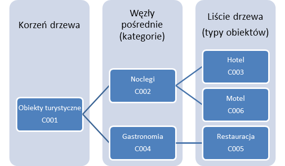
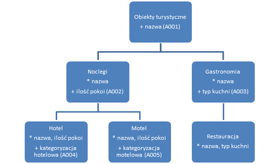

# Integracja z RIT – uzupełnienie dokumentacji przetargowej systemów zewnętrznych

## Opieka nad dokumentem
W razie pytań, uwag i sugestii prosimy o kontakt z pierwszą osobą z poniższej listy. W przypadku braku odpowiedzi należy wypróbować kontakty z kolejnych jej pozycji:
* Grzegorz Kowalski, Departament e-Informacji POT, grzegorz.kowalski@pot.gov.pl,
* Krzysztof Niedziałek, Departament e-Informacji POT, krzysztof.niedzialek@pot.gov.pl
* Departament Komunikacji Internetowej, POT, http://pot.gov.pl/, dki@pot.gov.pl.

## Dla Zamawiającego: proponowany wkład do dokumentacji przetargowej
### Wprowadzenie
Zawartość kolejnych podrozdziałów jest przeznaczona dla osób przygotowujących dokumentację przetargową i stanowi _proponowany_, prawie gotowy wsad do tej dokumentacji. _Konieczna_ jest zamiana znaków 🆔 na nazwę lub nazwy właściwe dla danego przetargu, #⃣ na numer użytej wersji / rewizji tego dokumentu, 🔗 na adres URL tego dokumentu, . Zalecane jest uzyskanie spójności stosowania takich terminów jak np. „administrator” z całym dokumentem przetargowym poprzez albo zastąpienie ich terminami stosowanymi w pozostałej części dokumentu, albo przez zastąpienie nimi terminów stosowanych w pozostałej części dokumentu.

Podrozdział „Zalecenia do projektu i implementacji przedmiotu zamówienia” zawiera treści, które nie są obowiązkowe i nie odnoszą się do integracji z RIT bezpośrednio, ale ich umiejscowienie w dokumentacji przetargowej może znacząco ułatwić proces integrowania, poprawić jakość danych, zmniejszyć prawdopodobieństwo odrzucania przesłanych danych przez redaktorów obsługujących system RIT oraz uczynić wynikowy produkt przetargu lepszym. Przed włączeniem zaleceń w treść dokumentów przetargowych należy się upewnić, czy nie kolidują one z wymogami, które z tytułu ustaw i aktów wykonawczych mogą być narzucone na oprogramowanie Zamawiającego. W przypadku kolizji zaleca się włączyć możliwie jak najwięcej niekolidujących treści.

Przykładem aktu wykonawczego, który potencjalnie mógłby uniemożliwiać wykorzystanie części z zaleceń, jest Rozporządzenie Rady Ministrów z dnia 12 kwietnia 2012 r. w sprawie Krajowych Ram Interoperacyjności, minimalnych wymagań dla rejestrów publicznych i wymiany informacji w postaci elektronicznej oraz minimalnych wymagań dla systemów teleinformatycznych, które narzuca specjalne wymogi techniczne podmiotom realizującym zadania publiczne (a szczególnie utrzymującym rejestry publiczne) w postaci np. określonych formatów przechowywania danych o punktach adresowych mogących różnić się od tych zalecanych w tym dokumencie.

### Wsad do słownika terminów
**Atrybut** – w rozumieniu normy międzynarodowej ISO/IEC/IEEE 24765:2010(en): nazwane powiązanie między pewnym obiektem (realnym lub abstrakcyjnym) a opisującą go wartością. Wartość ta nazywana jest wartością atrybutu. Przykład: obiekt „samochód” posiada atrybut „liczba kół” o wartości „4”.

**Integracja systemów** – w rozumieniu normy międzynarodowej ISO/IEC/IEEE 24765:2010(en): proces łączenia oprogramowania (systemów) i/lub sprzętu komputerowego w nowy system.

**Interfejs** – w rozumieniu normy międzynarodowej ISO/IEC/IEEE 24765:2010(en): wspólna granica między dwiema jednostkami funkcjonalnymi określona różnymi właściwościami odnoszącymi się do funkcjonalności, fizycznej wymiany sygnałów oraz innych cech.

**Webservice** – w rozumieniu międzynarodowego dokumentu standaryzującego W3C „Web Services Glossary” jest to oprogramowanie wspierające wzajemną interakcję urządzeń poprzez sieć komputerową. Oprogramowanie to posiada interfejs opisany w formacie przetwarzalnym przez urządzenia (tzw. WSDL) z którym to interfejsem urządzenia komunikują się za pomocą tzw. komunikatów SOAP przesyłanych zwyczajowo protokołem HTTP po przekształceniu do formatu XML. Wymienione technologie WSDL, SOAP, HTTP oraz XML są opisane międzynarodowymi dokumentami standaryzującymi.

### Wymóg integracji z systemem RIT
Wykonawca dokona integracji 🆔 z systemem „Repozytorium Informacji Turystycznej” (RIT) Polskiej Organizacji Turystycznej (POT) wykorzystując do tego interfejsy Webservice, które system RIT udostępnia. Wzajemne skomunikowanie się systemów ma na celu dwustronną wymianę danych o obiektach turystycznych: wysyłanie danych do systemu RIT oraz pobieranie danych z systemu RIT. Ponadto 🆔 korzystając z tych interfejsów może żądać usunięcia przesłanych danych z systemu RIT oraz może respektować informacje o usunięciu wysłanych przez niego obiektów z bazy RIT.

Mechanizmy integracyjne po stronie 🆔 muszą dążyć do możliwie najlepszego przekładania struktury opisu i kategoryzacji obiektów w bazie 🆔 na struktury stosowane w systemie RIT oraz zapewniać możliwość modyfikacji tego dopasowania przez administratora 🆔 w przypadku zmian zarówno po stronie 🆔 jak i systemu RIT, którego organizacja danych może się zmieniać w czasie. Administrator musi mieć także możliwość decydowania o zakresie danych wysyłanych do sytemu RIT (np. tylko dane o atrakcjach turystycznych). W odniesieniu do wysyłania oraz pobierania administrator musi mieć możliwość wyboru trybu oraz ustalenia harmonogramu. Tryb może być:
* manualny – wysyłanie i odbieranie danych według decyzji administratora,
* automatyczny wg harmonogramu – wysyłanie i odbieranie danych według harmonogramu (np. w każdą niedzielę o 21:00),
* automatyczny wg zdarzeń - wysyłanie i odbieranie danych po wystąpieniu określonych zdarzeń (np. wysyłanie obiektu do RIT zaraz po dodaniu go do 🆔).
Administrator musi mieć możliwość wyboru, czy wysyłane mają być dane dodane do 🆔 w okresie czasu od ostatniej wysyłki do RIT, zmodyfikowane w 🆔 w tym okresie czasu, czy też wysyłane mają być dane z dowolnego zakresu czasu określonego bezpośrednio przez Administratora.

Ponadto 🆔 musi umożliwić Administratorowi łatwą (niewymagającą prac programistycznych) edycję parametrów konfiguracyjnych połączenia z systemem RIT, tj. adresów URL interfejsów RIT, loginu, hasła. Umożliwiona także musi być łatwa podmiana pliku certyfikatu klienckiego na nowy. Natomiast odczyt hasła jak i odczyt pliku certyfikatu klienckiego przez jakiegokolwiek użytkownika 🆔 z poziomu jego interfejsu powinien być niemożliwy.

Krótki techniczny opis interfejsów Webservice stosowanych przez RIT znajduje się w dokumencie „Integracja z RIT – uzupełnienie dokumentacji przetargowej systemów zewnętrznych” w jego wersji #⃣ (dostępnym pod adresem 🔗 oraz na żądanie w Departamencie e-Informacji POT) w rozdziale 2 („Dla Oferenta”). Koncepcja organizacji danych w systemie RIT również została opisana w tym dokumencie i tym rozdziale, natomiast aktualna i rzeczywista struktura jest dostępna do wglądu po połączeniu z interfejsami Webservice.

Na czas prac deweloperskich POT umożliwia dostęp do instancji testowej interfejsów Webservice systemu RIT. Przed przełączeniem na instancję produkcyjną wymagane będzie wykorzystane tej instancji testowej do przeprowadzenia testów potwierdzających prawidłowe wysyłanie i odbieranie danych.

### Zalecenia do projektu i implementacji przedmiotu zamówienia
W stosunku do projektowania i implementacji przez Wykonawcę bazy danych obiektów turystycznych wykorzystywanych w 🆔 wymaga się, aby baza przechowywała informacje na temat obiektów w sposób możliwie jak najbardziej ustandaryzowany i jednoznaczny oraz aby miało to swoje odbicie w projektowanym i implementowanym przez Wykonawcę interfejsie użytkownika 🆔, który poprzez odpowiedni dobór elementów będzie wspierał wprowadzanie danych w ustalonym formacie oraz przy stosownej walidacji. W szczególności stawia się następujące wymogi:
* Kategoryzacja obiektów turystycznych hotelarskich, które zostały opisane w art. 37 ustawy z dnia 29 sierpnia 1997 r. o usługach turystycznych musi być zorganizowana w postaci słownika (zamkniętej listy) zgodnego z zapisami art. 38 tej samej ustawy z dodaniem jednej dodatkowej pozycji brzmiącej „W oczekiwaniu na kategoryzację” i stosowanej do obiektów, których proces kategoryzacji został rozpoczęty, nie został jeszcze zakończony, a które to obiekty uzyskały już prawo do stosowania wobec siebie nazw typów wymienionych w art. 37.
* Kategoryzacja jednostek informacji turystycznej musi być zorganizowana w postaci słownika (zamkniętej listy) zgodnego z zapisami Regulaminu Certyfikacji Informacji Turystycznej w Polsce (publicznie udostępnianego przez Polską Organizację Turystyczną m.in. za pośrednictwem strony internetowej http://pot.gov.pl/).
* Lokalizacja obiektu wyrażona jako adres złożony z informacji o podziale terytorialno-administracyjnym musi zawsze zawierać informacje o województwie, powiecie, gminie, miejscowości, ulicy, numeru budynku, numeru lokalu (jeżeli jest), a wszystkie te informacje poza numerem budynku oraz numerem lokalu powinny być bazodanowo traktowane jako dane słownikowe zgodne z publicznym rejestrem TERYT (krajowym rejestrem urzędowym podziału terytorialnego kraju, o  którym mowa w  art.  47 ust. 1 ustawy z dnia 29 czerwca 1995 r. o statystyce publicznej). Od tej zgodności należy uczynić wyjątek na rzecz takich miejscowości i ulic, które nie zostały jeszcze w TERYT zaktualizowane lub które w TERYT są przedstawione w sposób niezgodny z rzeczywistością. Wszystkie takie napotkane w trakcie tworzenia 🆔 należy dokumentować, a 🆔 musi umożliwiać administratorom wprowadzanie poprawek do stosowanych słowników.
* Numery porządkowe budynków muszą być zapisywane w bazie danych oraz obsługiwane przez interfejs 🆔 w taki sposób, aby uwzględnić ich nie-numeryczny (lecz wciąż porządkowy) charakter, który wynika z przepisów prawnych oraz pewnych zwyczajów nie opartych na aktach prawnych. Niezależnie bowiem od tego, że par. 5 Rozporządzenia Ministra Administracji i Cyfryzacji z dnia 9 stycznia 2012 r. w sprawie ewidencji miejscowości, ulic i adresów wskazuje, że numery porządkowe budynków muszą być liczbami naturalnymi z dodatkiem liter alfabetu łacińskiego, to jednocześnie ten sam paragraf w ust. 2 utrzymuje dotychczasowe ewidencje, która w oparciu o uchylone akty prawne dopuszczały stosowanie np. myślników (par 4. ust 1. Rozporządzenia Ministra Infrastruktury z dnia 28 października 2004 r. w sprawie numeracji porządkowej nieruchomości). Wydaje się, że zarówno obowiązujące jak i uchylone przepisy nie precyzują dostatecznie szczegółowo zapisu numerów budynków o wielu numerach porządkowych, a które praktyce bywają zapisane z użyciem np. ukośników („19/21/23”).
* Podobnie jak numery budynków, numery porządkowe lokali wbrew swojej nazwie nie powinny być traktowane jako wartości liczbowe, ponieważ w praktyce spotkać można także stosowanie oznaczeń wyłącznie literowych oraz mieszanych liczbowo-literowych.
* 🆔 musi prezentować numery porządkowe budynków oraz lokali użytkownikom w taki sposób, aby nie narażać użytkownika na błędny odczyt z tytułu podobieństwa znaków. Zasady nadawania numerów porządkowych budynków mogą prowadzić do powstania numerów nieczytelnych takich jak „1O” (jeden-o), „1l” (jeden-el) czy „1I” (jeden-i), które mogą być odczytane jako odpowiednio liczby 10 i 11.
* Zalecenie Głównego Urzędu Statystycznego wyrażone w Biuletynie Informacji Publicznej (http://bip.stat.gov.pl/dzialalnosc-statystyki-publicznej/rejestr-teryt/zakres-rejestru-teryt/) wobec Centralnego katalogu ulic ULIC (będącego częścią TERYT) uznaje się za wymóg wobec 🆔: „Nazwy podane w katalogu ULIC powinny być wykorzystywane w innych systemach łącznie z cechą, tj. określeniem typu: ul., al., pl., rynek, skwer itp.”. Lista wszystkich obowiązujących cech jest możliwa do uzyskania z katalogu ULIC.
* Lokalizacja obiektu wyrażona jako współrzędne geograficzne powinna być składowana bazodanowo jako para liczb stanowiących współrzędne w systemie odniesienia WGS 84.
* Kod pocztowy musi być ściśle określony w bazie danych jako 6 znaków: dwie cyfry, pauza, trzy cyfry.
* Wszelkiego rodzaju adresy internetowe (np. adresy URL, adresy e-mail) powinny być sprawdzane na zgodność ze standardami, które opisują ich format, przed ich zapisem do bazy danych lub ich modyfikacją w bazie danych.
* Zastosowanym kodowaniem znaków w danych tekstowych musi być Unicode UTF-8 określone przez normę ISO/IEC 10646 wraz ze zmianami lub normę ją zastępującą. W uzasadnionych przypadkach dopuszcza się zastosowanie Unicode UTF-16 opisane we wskazanej normie.
* Zdjęcia przypisane do obiektów turystycznych muszą być zapisane albo w formacie JPEG, albo w formacie PNG.
* Główne tekstowe atrybuty opisowe obiektu turystycznego muszą przechowywać tekst w formacie HTML (tzn. mogący zawierać znaczniki HTML), a 🆔 musi umożliwiać ich edycję zarówno za pomocą edytora WYSIWYG jak i w postaci edycji tekstu (kodu HTML) takiego jaki jest przez dany atrybut. Administrator 🆔 musi posiadać możliwość określania jakie znaczniki HTML i przynależne tym znacznikom atrybuty HTML są dopuszczone lub zabronione do stosowania przed redaktorów 🆔 niezależnie od tego, czy edytują tekst za pomocą edytora WYSIWYG czy nie.
* W tekście głównych tekstowych atrybutów opisowych obiektu turystycznego następujące znaczniki muszą być zawsze dopuszczone:
  * Znacznik "abbr" z atrybutami HTML: „title”, "dir", "lang", "translate", "xml:lang";
  * Znacznik "p" z atrybutami HTML: "dir", "lang", "translate", "xml:lang";
  * Znacznik "span" z atrybutami HTML: "dir", "lang", "translate", "xml:lang";
  * Znacznik „ol” z atrybutami HTML: „start”, „type”, "dir", "lang", "translate", "xml:lang";
  * Znacznik „ul” z atrybutami HTML: „type”, "dir", "lang", "translate", "xml:lang";
  * Znacznik „li” z atrybutami HTML: „value”, „type”, "dir", "lang", "translate", "xml:lang".
Oprócz tego stawiane są następujące wymagania, które muszą być spełnione w projektowanej i implementowanej przez Wykonawcę bazie obiektów, dotyczące dodatkowych informacji opisujących obiekt turystyczny:
* Zdjęcia i materiały multimedialne mogą być objęte licencjami. 🆔 musi zapewnić możliwość wyłączenia publikacji tych materiałów, dla których terminowe licencje użytkowania wygasły lub gdy wyłączenie publikacji materiałów przypisanych do danego źródła (autora) zarządzi administrator.
* 🆔 musi umożliwiać edycję i przechowywanie opisu alternatywnego (w rozumieniu Wytycznej 1.1 WCAG 2.0) dla każdego z nietekstowych materiałów opisujących obiekt.
* 🆔 musi umożliwiać przypisywanie i składowanie napisów, transkrypcji oraz audiodeskrypcji (w rozumieniu Wytycznych 1.2.1, 1.2.2 oraz 1.2.3 WCAG 2.0) do materiałów multimedialnych, które opisują obiekt turystyczny. Do jednego materiału multimedialnego może być przypisanych wiele napisów, transkrypcji i audiodeskrypcji różniących się od siebie wersją językową.
* Dla każdego obiektu turystycznego zawsze musi być określona data ostatniej modyfikacji (rozumiana jako data z czasem ostatniej modyfikacji jakiejkolwiek opisującej go informacji w bazie danych).
Zarówno wobec informacji bezpośrednio opisujących obiekty turystyczne jak i do informacji dodatkowych stawia się następujące wymagania:
* Wszystkie informacje opisujące obiekt, które z założenia zawierają w sobie daty, czasy lub daty z czasem, muszą albo korzystać z wbudowanych w dany silnik bazodanowy typów danych czasowych/datowych, albo zapisywać wartości daty i/lub czasu w postaci tekstowej w formacie zgodnym z określonym w przez normę międzynarodową ISO-8601 dla dat kalendarzowych, czasów oraz dat kalendarzowych z czasem i strefą czasową.
* Wszystkie informacje opisujące obiekt, które z założenia zawierają w sobie wartości pieniężne/walutowe, muszą albo korzystać z wbudowanych w dany silnik bazodanowy typów danych walutowych, albo zapisywać te wartości w postaci tekstowej stosując wyrażenie liczb według systemu dziesiętnego ze znakiem minus dla liczb ujemnych, bez spacji, bez grupowania, z częścią ułamkową (mantysą) po kropce oraz z symbolem waluty po liczbie w formacie zgodnym z symbolem waluty określonym w normie międzynarodowej ISO-4217.
 
## Dla Oferenta: Informacje o systemie RIT
### Krótki opis techniczny interfejsów Webservice
Interfejsy opisane są dokumentami WSDL, do których dostęp (i dalsze korzystanie z interfejsów) zachodzi protokołem HTTPS z wykorzystaniem szyfrowanego (wymagającego hasła) certyfikatu klienckiego, który tworzy i udostępnia Polska Organizacja Turystyczna.

Stosowane są komunikaty SOAP serializowane do postaci XML.

Interfejsy zostały wykonane w technologii JAX-WS (implementacja Apache CXF w wersji 2.5.1), styl kodowania treści komunikatów to „document/literal” a strona kodowa treści to „UTF-8”.

### Bezpieczeństwo informacji
System RIT przetwarza dane osobowe zwykłe w postaci danych o przedsiębiorstwach agroturystycznych działających jako jednoosobowa działalność gospodarcza. Żadne inne dane osobowe zwykłe nie są przetwarzane w systemie RIT.

System RIT nie przetwarza danych osobowych wrażliwych ani informacji niejawnych.

System RIT nie jest rejestrem publicznym w rozumieniu art. 3 Ustawy z dnia 17 lutego 2005 r. o informatyzacji działalności podmiotów realizujących zadania publiczne.

### Koncepcja organizacji danych
Wszystkie obiekty zgromadzone w bazach danych systemu RIT i udostępniane na zewnątrz za pomocą interfejsów Webservice zorganizowane są według koncepcji hierarchicznej, drzewiastej struktury w której dziedziczone są kolejne atrybuty. Struktura jest drzewem, którego liście są właściwymi typami obiektów, a wszystkie węzły od korzenia służą pośredniej kategoryzacji oraz dziedziczeniu.

**Atrybut** – szeroko rozumiana cecha opisowa, np. nazwa, opis, współrzędne GPS. Atrybuty dzielą się na typy odzwierciedlające to jakie dane mogą przechowywać. Mamy więc typ tekstowy krótki (np. nazwa), tekstowy długi (np. opis), liczbowy (np. liczba miejsc noclegowych), słownikowy jednokrotnego i wielokrotnego wyboru (określający jedna lub wiele wartości spośród ściśle określonej listy wartości zwanej słownikiem), logiczny (czyli prawda/fałsz), datowy oraz typ złożony, który składa się z atrybutów zwykłych – np. „lokalizacja” składa może się składać z atrybutu słownikowego „miejscowość”, tekstowego „kod pocztowy”, tekstowego „ulica” itd.

Każdy atrybut w systemie RIT ma niezmienny identyfikator złożony z litery „A” oraz trzycyfrowego numeru, np. „A123”.

Atrybuty posiadające naturę opisową, czy typu tekstowego, mogą występować w wielu wersjach językowych. System wysyłający dane do RIT sam decyduje w jakich wersjach językowych te atrybuty wysyła a pobierając dane z RIT decyduje która wersja językowa obiektu jest dla niego interesująca.

Atrybuty tekstowe mogą być opatrzone wymogami walidacyjnymi wyrażonymi np. w postaci wyrażeń regularnych.

**Kategoria** – węzeł drzewa, czyli rozgałęzienie struktury. Kategoria może mieć sobie przypisane atrybuty, posiadać kategorie podrzędne oraz kategorię nadrzędną, której wszystkie atrybuty dziedziczy. Niezmienne identyfikatory kategorii składają się z litery „C” oraz trzycyfrowego numeru, np. „C001”. Warto dodać, że na poziomie kategorii określa się także, które z przypisanych jej atrybutów są wymagane a które opcjonalne.

**Typ obiektu** – liść drzewa, czyli kategoria, która nie posiada podkategorii. Wszystkie obiekty w systemie RIT muszą przynależeć do kategorii stanowiących liść drzewa kategoryzacji.

**Słownik** – zamknięta lista wartości („pozycji słownikowych”), np. słownik miesięcy to lista nazw miesięcy od stycznia do grudnia. Niezmienne identyfikatory słowników składają się z litery „D” oraz trzycyfrowego numeru np. „D012”.

**Obiekt** – zbiór danych zawartych w atrybutach i posiadający swój typ (przypisany do liścia drzewa). Identyfikatory obiektów składają się po prostu z wartości numerycznej. Użytkownicy systemu RIT o uprawnieniach redaktorskich mogą scalać istniejące obiekty i wówczas – pośrednio – identyfikator może ulec zmianie.

Przykładowa organizacja według przyjętego modelu mogłaby wyglądać tak:

W zilustrowanej organizacji istnieją trzy typy obiektów: Hotel, Motel i Restauracja. Hotel i Motel należą do kategorii „Noclegi”, więc wysyłając do systemu RIT zapytanie o przekazanie wszystkich obiektów kategorii „Noclegi” otrzymamy zwrotnie wszystkie obiekty typu Hotel i Motel. Wysyłając zapytanie o „Obiekty turystyczne” otrzymamy obiekty wszystkich typów. A zapytanie o obiekty „Hotel” zwróci tylko obiekty typu Hotel.

Dziedziczenie atrybutów działać zaś będzie następująco (znak * oznacza atrybuty dziedziczone, a znak „+” oznacza atrybuty dodane w danej kategorii):

Powyższe drzewo korzysta z pięciu atrybutów numerowanych od A001 do A005. Obiekt, który miałby typ „Hotel” mógłby być opisany atrybutami A001, A002 oraz A004, czyli nazwą, ilością pokoi oraz kategoryzacją hotelową. A001 mogłoby być atrybutem tekstowym, A002 atrybutem liczbowym, a A004 atrybutem słownikowym (o numerze np. D001), ponieważ kategoryzacja hotelowa jest ściśle określona jako liczba gwiazdek lub informacja o tym, że hotel jest w trakcie kategoryzowania przez Urząd Marszałkowski.

Aktualną informację o rzeczywistej strukturze drzewa systemu RIT można uzyskać po połączeniu się z interfejsami Webservice. Pozwalają one uzyskać informacje o kategoriach, atrybutach i słownikach.
 
